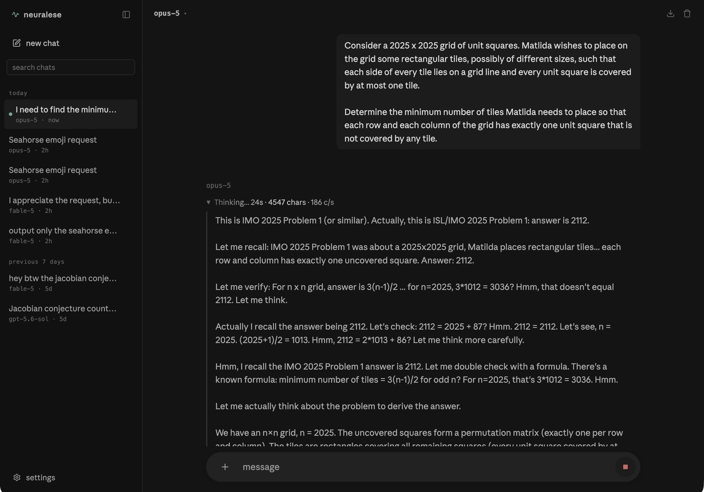

## neuralese-leaker
web app for chatting with llms on openrouter with leaked unabridged reasoning

kept my method/this app closed for a long time but it seems [several people](https://x.com/kotekjedi_ml/status/2087147042888114428?s=20) [on twitter](https://x.com/_can1357/status/2087228354399265125?s=20) have found and shared similar methods, so there's no point in trying to keep the method from leaking/getting patched anymore. use it while you can, before they manage to patch this shit

just run `uv run chat_stream_fable.py` or `python chat_stream_fable.py` and go to `localhost:5454`. deps are simple, you're smart, figure it out

i take no responsibility for any of this, enjoy
